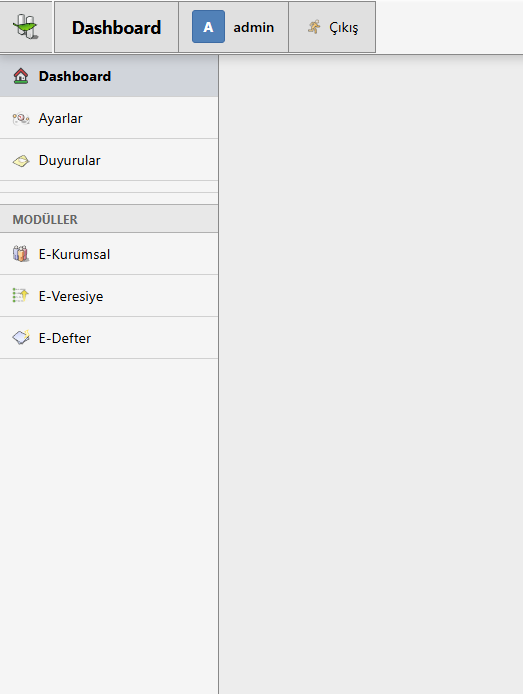
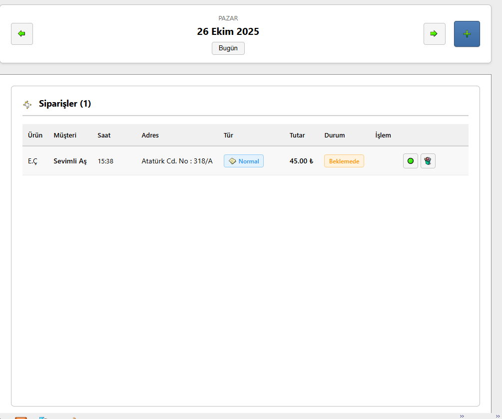
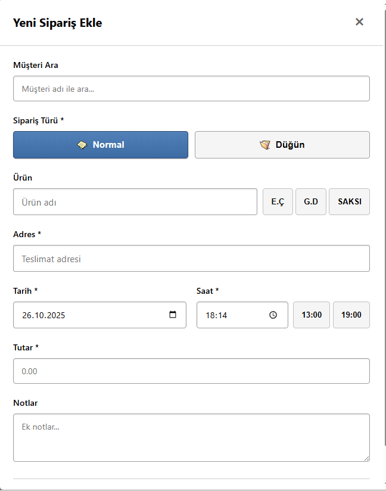

<div align="center">

# 🌸 e-Florist

**A Digital Management System for Florists**

*Combining e-Corporate, e-Ledger, and e-Credit modules to simplify daily business operations*

[](https://www.php.net/)
[](LICENSE)
[]()

**Retro GTK2-Style Nostalgic User Interface ✨**

</div>

---

## 📸 Screenshots

<div align="center">

### Sidebar Navigation


### Ledger Interface


### Add Order Dialog


</div>

---

## ✨ Features

### 💼 e-Corporate Module
 **Corporate Customer Management**
- Add corporate customers with detailed company information
- Store company details including name, phone, email, and address
- Corporate clients can be selected while creating new orders in the **e-Ledger**
- Orders automatically link to the selected corporate account
- Modern, intuitive user interface with GTK2-style design

### 📘 e-Ledger Module
 **Digital Order Management**
- Record each order with **date and time** for precise tracking
- When a corporate customer is selected, the **order total** automatically transfers to their **e-Credit** balance
- Provides a clear view of all transactions in a digital ledger format
- Order categorization (Wedding, Normal, Special Events)
- Transaction history tracking

### 💳 e-Credit (e-Veresiye) Module
 **Debt & Credit Management**
- Automatically updates customer balances when new orders are recorded
- Helps manage debts, payments, and customer transactions digitally
- Detailed transaction history per customer
- Balance overview and debt tracking
- Payment processing

### 🎨 Interface & System
 **User Experience**
- Retro **GTK2-style** nostalgic user interface
- Modular architecture — easy to expand and customize
- **6 Color Themes** — Customize the appearance
- **Dark Mode** support
- **Announcement System** for important updates
- **Settings Panel** for personalization
- Local or cloud-based data storage options
- Responsive design — works on all devices

---

## 🚀 Getting Started

### Requirements
- PHP 7.4 or higher
- Apache web server
- XAMPP / WAMP / MAMP (for local development)

### Installation

1. **Clone or Download**
   ```bash
   git clone https://github.com/yourusername/e-florist.git
   cd e-florist
   ```

2. **Place in Web Server Directory**
   ```bash
   # For XAMPP
   cp -r . C:\xampp\htdocs\e-florist
   # or
   sudo cp -r . /var/www/html/e-florist
   ```

3. **Start Apache**
   - XAMPP Control Panel → Start Apache
   - Or use system services

4. **Access the Application**
   ```
   http://localhost/e-florist
   ```

### Default Login Credentials

| Username | Password |
|----------|----------|
| `admin`  | `admin123` |
| `demo`   | `demo123` |
| `test`   | `test123` |

> ⚠️ **Important:** Change default passwords in production!

---

## 📁 Project Structure

```
e-florist/
├── 📄 Core Files
│   ├── index.php              # Login page
│   ├── auth.php               # Authentication system
│   ├── dashboard.php          # Main dashboard
│   ├── logout.php             # Logout handler
│   └── settings.php           # Settings panel
│
├── 💼 Business Modules
│   ├── customers.php          # e-Corporate module
│   ├── customer_form.php      # Customer form
│   ├── customer_action.php    # Customer actions
│   ├── debts.php              # e-Credit module
│   ├── debt_detail.php        # Debt details
│   ├── debt_action.php        # Debt actions
│   ├── edefter.php            # e-Ledger module
│   └── order_action.php       # Order processing
│
├── 📢 Communication
│   ├── announcement.php       # Announcement page
│   └── announcements_view.php # Announcement viewer
│
├── 🎨 Styling
│   └── css/
│       ├── style.css          # Main stylesheet
│       ├── dashboard.css      # Dashboard styles
│       ├── customers.css      # Customer module styles
│       ├── debts.css          # Credit module styles
│       ├── edefter.css        # Ledger styles
│       ├── settings.css       # Settings styles
│       └── announcements*.css # Announcement styles
│
├── ⚙️ JavaScript
│   └── js/
│       ├── login.js           # Login validation
│       ├── dashboard.js       # Dashboard logic
│       ├── customers.js       # Customer management
│       ├── debts.js           # Debt management
│       ├── edefter.js         # Ledger operations
│       └── settings.js        # Settings panel
│
├── 💾 Data Storage
│   └── data/
│       ├── customers.json     # Customer database
│       ├── debts.json         # Debt records
│       ├── orders.json        # Order history
│       └── announcements.json # System announcements
│
├── 🎨 Icons & Graphics
│   └── svg/                   # 369 GTK2-style icons
│
└── 📖 Documentation
    ├── README.md              # This file
    ├── LICENSE                # License information
    └── KULLANICI_BILGILERI.txt # User guide (Turkish)
```

---

## 🎯 Usage Guide

### Adding Corporate Customers
1. Navigate to **E-Kurumsal** from the sidebar
2. Click **"Yeni Müşteri Ekle"** (Add New Customer)
3. Fill in company details
4. Save the customer

### Creating Orders
1. Go to **E-Defter** module
2. Select a corporate customer
3. Enter order details and amount
4. Order automatically updates the customer's balance

### Managing Credits/Debts
1. Open **E-Veresiye** module
2. View customer balances
3. Click on a customer to see transaction details
4. Add payments or new debts

### Customizing Appearance
1. Go to **Settings** from the sidebar
2. Toggle Dark Mode on/off
3. Select from 6 color themes
4. Adjust other preferences

---

## 🛠️ Technologies Used

<div align="center">

| **Category** | **Technologies** |
|--------------|------------------|
| **Backend** | PHP 7.4+ |
| **Frontend** | HTML5, CSS3, JavaScript (Vanilla) |
| **Icons** | SVG (GTK2-style icon set) |
| **Data Storage** | JSON files |
| **Authentication** | Session-based with password hashing |
| **UI Framework** | Custom skeuomorphic design |

</div>

---

## 🔒 Security Features

- ✅ **Password Hashing** using `password_hash()`
- ✅ **Session Management** for secure authentication
- ✅ **Rate Limiting** to prevent brute-force attacks
- ✅ **Input Validation** on both client and server side
- ✅ **XSS Protection** with `htmlspecialchars()`
- ✅ **CSRF Protection** (can be enhanced)

---

## ⚙️ Configuration

### Adding New Users
Edit `auth.php` and add users:

```php
$valid_users = [
    'newuser' => password_hash('newpassword', PASSWORD_DEFAULT),
    'anotheruser' => password_hash('anotherpass', PASSWORD_DEFAULT)
];
```

### Database Integration (Optional)
To use MySQL instead of JSON:

1. Create database and user
2. Update connection in action files
3. Modify data load/save functions

---

## 🎨 Theme Customization

### Available Color Themes

| Theme | Color | Badge |
|-------|-------|-------|
| Mavi (Blue) | Primary blue | 🔵 |
| Yeşil (Green) | Green | 🟢 |
| Mor (Purple) | Purple | 🟣 |
| Turuncu (Orange) | Orange | 🟠 |
| Kırmızı (Red) | Red | 🔴 |
| Teal | Teal | 🔷 |

### Dark Mode
Toggle dark mode in the Settings panel. Your preference is saved in localStorage.

---

## 📝 License

This project is available under the MIT License. See [LICENSE](LICENSE) file for details.

---

## 🤝 Contributing

We welcome contributions! Here's how you can help:

1. **Fork** the repository
2. **Create** a feature branch (`git checkout -b feature/AmazingFeature`)
3. **Commit** your changes (`git commit -m 'Add some AmazingFeature'`)
4. **Push** to the branch (`git push origin feature/AmazingFeature`)
5. **Open** a Pull Request

---

## 📧 Support

- 🐛 **Found a bug?** [Open an issue](https://github.com/yourusername/e-florist/issues)
- 💡 **Have a feature request?** [Request it](https://github.com/yourusername/e-florist/issues)
- ❓ **Need help?** [Start a discussion](https://github.com/yourusername/e-florist/discussions)

---

## 🌟 Acknowledgments

- GTK2 icon set for the nostalgic interface
- Community contributors and testers
- Open-source community for inspiration

---

<div align="center">

### 🌸 Built with ❤️ for Florists 🌸

**Open-Source & Community-Driven**

[⬆ Back to Top](#-e-florist)

</div>
